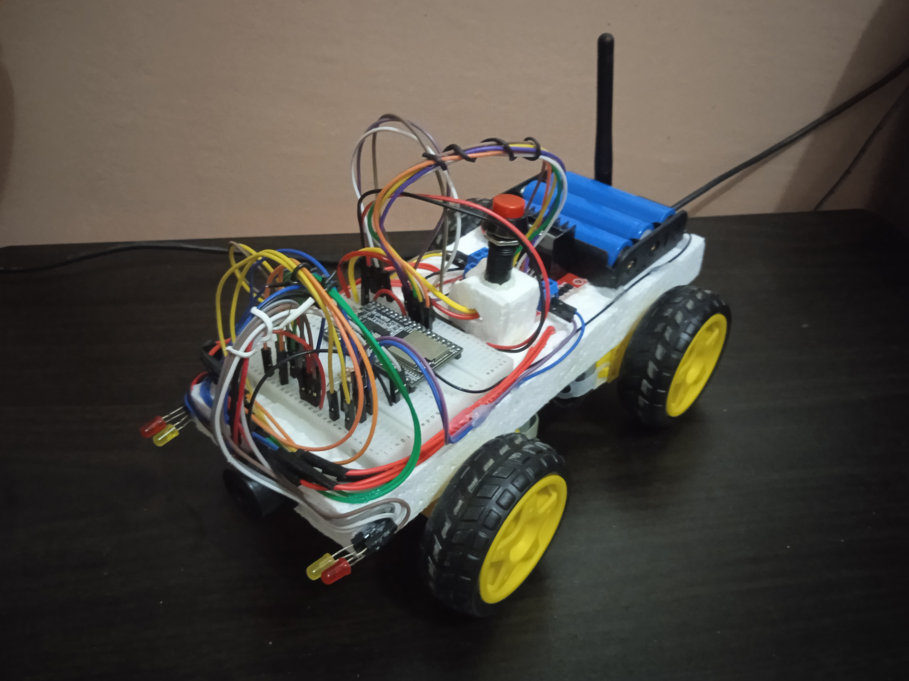

# Remote Control Car

This innovative remote-controlled car is equipped with four powerful DC motors. The car establishes a Wi-Fi access point, then it creates a TCP server on port 8080. The Android application provides user interface and connects to the car server to transmit commands. The car processes and executes these commands. Notably, the Android application leverages the SpeechRecognizer API to convert speech input into actionable commands executable by the car which allows the car to be controlled by voice input.

    

### Materials Used

- 4x TT Gear DC Motors
- ESP32 with antenna
- L298n motor driver
- 3x 5800mah 18650 3.7v Lithium-ion battery
- 3 slot battery holder for 18650 batteries
- Jumper wires
- Bread board
- 4x LED lights
- Buzzer
- ON/OFF switch
- Styrofoam
